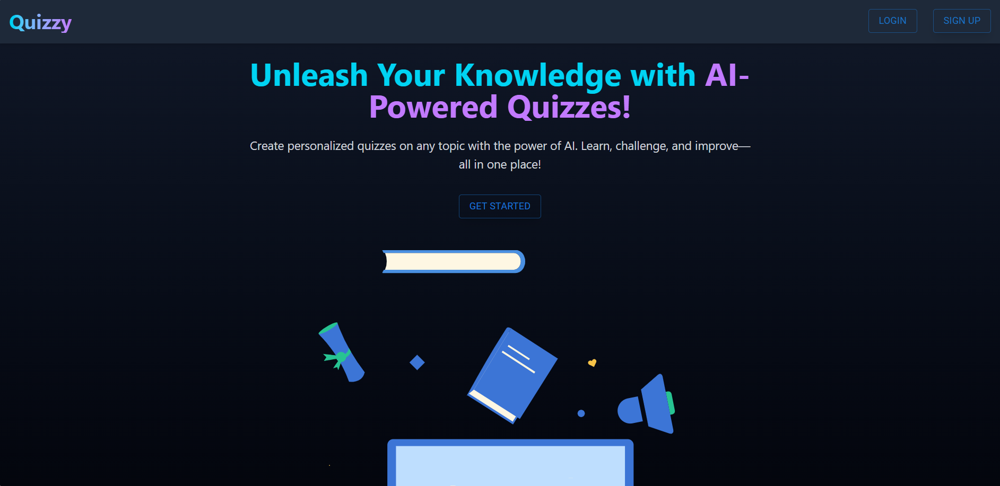
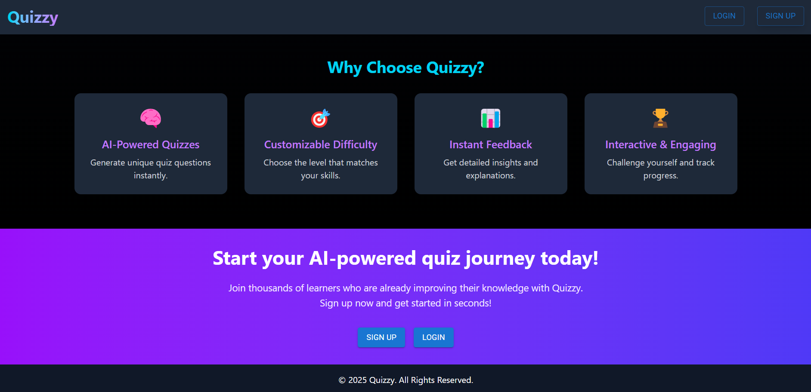
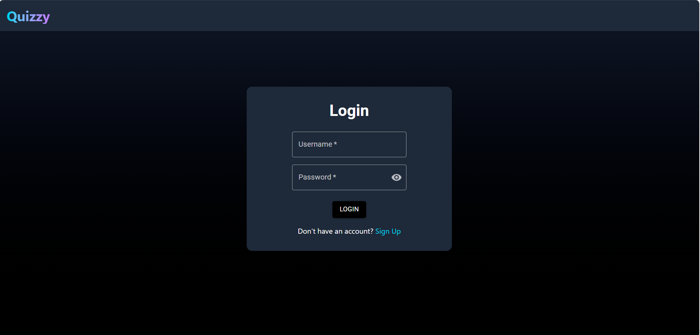
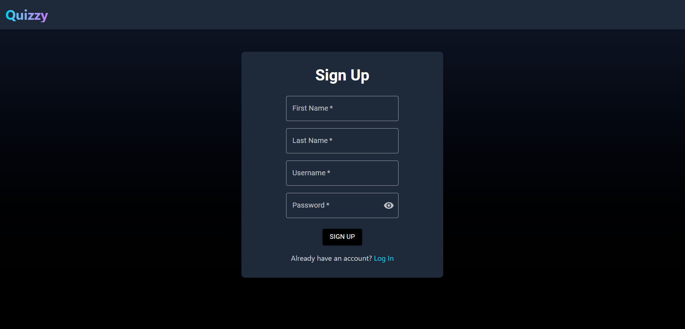
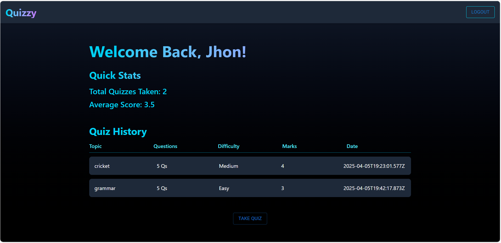
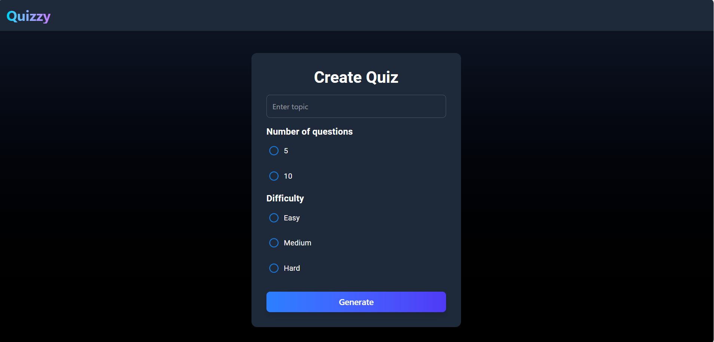
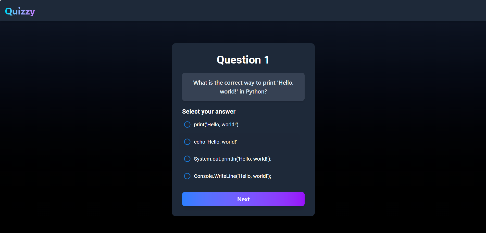
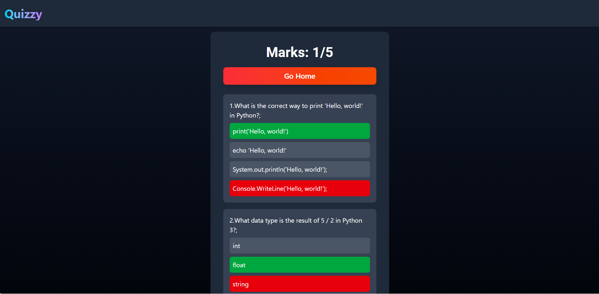

# 🎓 AI Quiz App

An AI-powered quiz application that generates dynamic questions based on user preferences and provides real-time scoring.

---

## 🚀 Features

- ✅ AI-generated quiz questions using Gemini API  
- ✅ Multiple-choice questions with real-time feedback  
- ✅ Score tracking and countdown timer  
- ✅ Responsive UI for both mobile and desktop  
- ✅ User authentication and quiz history tracking

---

## 🧠 Tech Stack

- **Frontend:** React, Tailwind CSS  
- **Backend:** Node.js, Express  
- **Database:** MongoDB  
- **AI Integration:** Gemini API

---

## 📁 Project Structure
AI-QuizApp/
├── frontend/         # React frontend
│   └── npm run dev   # Start the frontend
├── backend/          # Node.js + Express backend
│   └── node index.js # Start the backend


---

## 🔧 Getting Started

Follow these steps to run the project locally:

### 1. Clone the Repository

```bash
git clone https://github.com/Devesh102030/AI-QuizApp.git
cd AI-QuizApp

#Start the backend
cd backend
npm install
node index.js

#Start the frontend
cd ../frontend
npm install
npm run dev

```
## 📸 Screenshots

### 🏠 Home Page



### Login Page


### Sign Up Page


### 📊 Dashboard


### Quiz Page




---

Contact
📧 Email: deveshparyani17@gmail.com